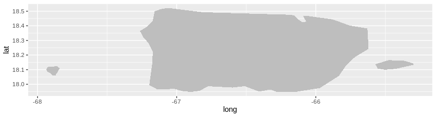
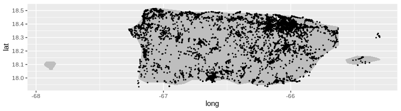
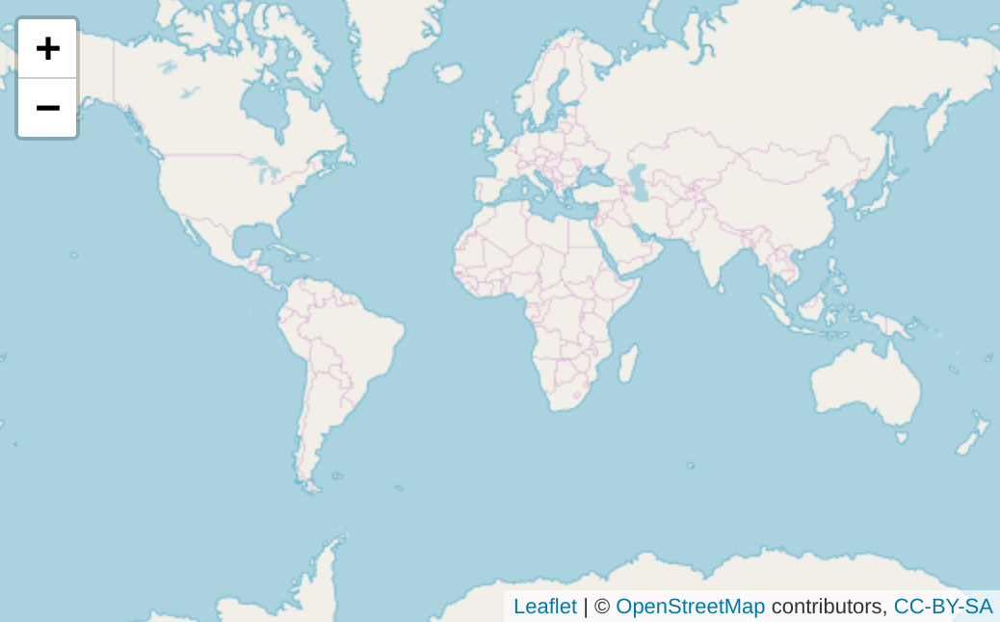
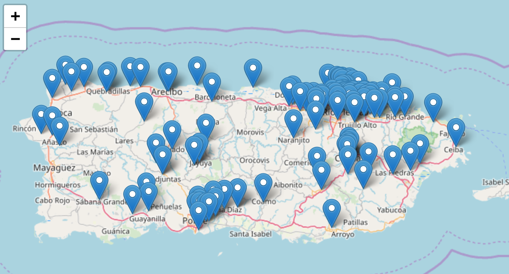
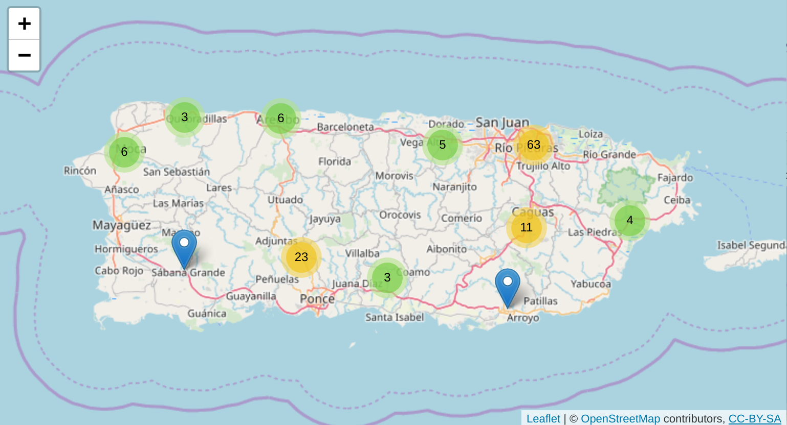

---
output:
  xaringan::moon_reader:
    css: "_include/aprender.css"
    seal: false
    nature:
      countIncrementalSlides: yes
      highlightLines: yes
      highlightStyle: github
      ratio: 16:9
resource_files:
  - include
---
---
class: title-slide, middle, center
# Mapas con R

---
class: dark, middle, center
# `ggplot2`

---
class: regular
### Use `map_data()` y `geom_map()` para crear mapas 

```{r, eval = FALSE}
pr <- map_data("world", region = "Puerto Rico")
ggplot() + geom_map(aes(long, lat, map_id = region), 
                    fill = "gray",  map = pr, data = pr) 
```
```{r, out.height = 300, out.width = 1000, fig.align = "center", echo = FALSE}

```
---
class: regular
### Agrege más capas para completar el mapa

```{r, eval = FALSE}
ggplot() + geom_map(aes(long, lat, map_id = region), 
                    fill = "gray",  map = pr, data = pr) +
  geom_point(aes(longitud, latitud), size = 0.4, data = crm)
```
```{r, out.height = 300, out.width = 1000, fig.align = "center", echo = FALSE}

```

---
class: dark, middle, center
# Introduciendo `leaflet`

---
class: regular
### Mapas se generan por capas

```{r, eval = FALSE}
leaflet() %>% addTiles() 
```
```{r, out.height = 350, out.width = 850, fig.align = "center", echo = FALSE}

```

---
class: regular
### Puntos de interes se agregan en otra capa

```{r, eval = FALSE}
leaflet() %>% addTiles() %>%
  addMarkers(~longitud, ~latitud, 
             data = filter(crm, month(fecha) == 8))
```
```{r, out.height = 350, out.width = 850, fig.align = "center", echo = FALSE}

```

---
class: regular
### Es facíl agregar grupos

```{r, eval = FALSE}
leaflet() %>% addTiles() %>% addMarkers(
  ~longitud, ~latitud, data = filter(crm, month(fecha) == 8), 
  clusterOptions = markerClusterOptions())
```
```{r, out.height = 350, out.width = 850, fig.align = "center", echo = FALSE}

```
